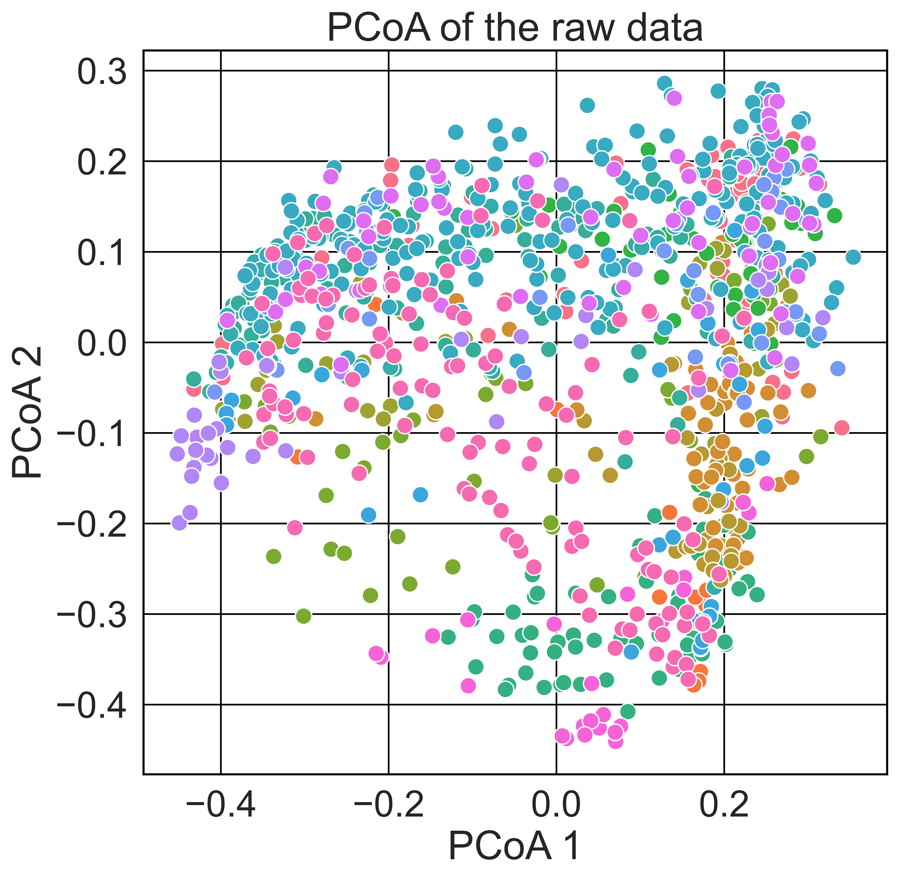
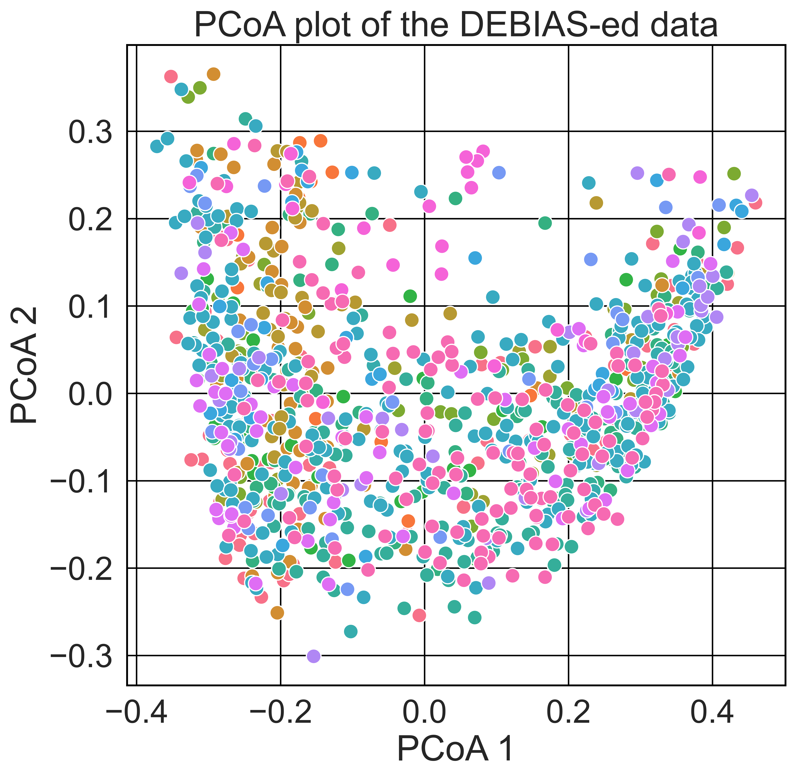
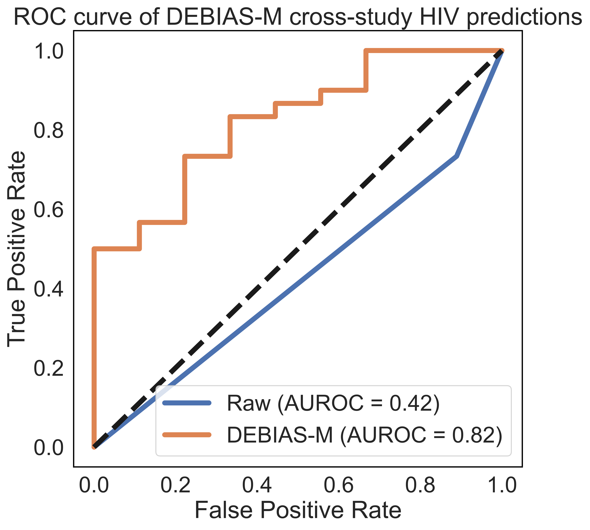

<style>
.darkgreen {
  background-color: #577836;
  color: white;
  border: 2px solid black;
  margin: 20px;
  padding: 20px;
} 
</style>

<style>
    body { 
            background-color: #16153C;
            text-color: whitesmoke;
            color: whitesmoke;
            font-family: Palatino;
            font-size: 12pt;
            margin: 10px;
            padding: 0px;
            }
</style>
            
```{css, echo=FALSE}
.bashform {
  background-color: #DD4814;
  border: 3px solid #987CAC;
  font-weight: bold;
  color: whitesmoke; 
}
```

```{r klippy, echo=FALSE, include=TRUE}
klippy::klippy(c('r', 'python', 'bash'), 
               position = c("top", "right"),
               color='brown',
               tooltip_message = "Copy",
               tooltip_success = "Copied!"
               )
```

<style>
.citation {
  background-color: #A1DDF2;
  color: black;
  border: 3px solid #987CAC;
  margin: 20px;
  padding: 20px;
} 
</style>

<style>
.codecell {
  background-color: #A1DDF2;
  color: black;
  border: 3px solid #987CAC;
  margin: 10px;
  padding: 10px;
  font-weight: bold;
  }
  li {
    list-style-type: none
  }
</style>


<br><br><br>


# Tutorial

In this page, we offer an example analysis of the DEBIAS-M classifier. For this analysis, we use the collection of HIV studies that is available on [Synapse](https://www.synapse.org/#!Synapse:syn18406854). For a full set of analyses performed by DEBIAS-M on this dataset, please refer to the [DEBIAS-M publication](10.1101/2024.02.09.579716).


Loading packages, data
-----------
```python
## import packages
import numpy as np
import pandas as pd
from debiasm import DebiasMClassifier
from debiasm.torch_functions import rescale
import matplotlib.pyplot as plt
import seaborn as sns
from sklearn.metrics import roc_curve, auc
from sklearn.metrics import pairwise_distances
from sklearn.linear_model import LogisticRegression
from skbio.stats.ordination import pcoa
import matplotlib.pyplot as plt


import numpy as np
import pandas as pd
import glob
import os

def load_HIVRC(data_path):
    df = pd.read_csv(os.path.join(data_path,
                                   'insight.merged_otus.txt'),
                     sep='\t', 
                     index_col=0
                    ).iloc[:, :-1].T
                    
    ## we generally recommend some minimum presence OTU filter 
    df = df.loc[:,((df>0).sum(axis=0) > df.shape[0]*.05 )] 
    md = pd.read_csv(os.path.join(data_path,
                                  'metadata.tsv'),
                     sep='\t')
    md = md.set_index('SeqID').loc[df.index]
    md['label'] = md['hivstatus']==1
    return((df, md))


df, md = data_loading.load_HIVRC(data_path='.') ## this assumes the data is downloaded to the same directory, can change as needed
X_with_batch = pd.concat([pd.Series(pd.Categorical(md.Study).codes, 
                                    index=md.index, 
                                    name='batch'),
                          df
                          ], axis=1)
                              
                              
```

PCoA of raw data
--------------
```python
# Compute a distance matrix (using Bray-Curtis distance)
distance_matrix = pairwise_distances(rescale(df.values),
                                     metric='braycurtis')

# Perform PCoA analysis
ordination_result = pcoa(distance_matrix, number_of_dimensions=2)

# Extract the first two principal coordinates
x_coords = ordination_result.samples.iloc[:, 0]
y_coords = ordination_result.samples.iloc[:, 1]


plt.figure(figsize=(8,8))
sns.scatterplot(x=x_coords,
                y=y_coords,
                hue=md.Study.values,
                s=100
                )

# Add labels and title
plt.xlabel('PCoA 1')
plt.ylabel('PCoA 2')
plt.title('PCoA of the raw data')

plt.legend().remove()
plt.grid(True)
plt.show()
```
<center>

</center>

Predictive analysis
--------------
We demonstrate the following code using DEBIAS-M with default parameters, using one study as a test set. 

```python
test_sd_number=5 ## index of the test study
train_inds = md.Study!=md.Study.unique()[test_sd_number]

## run DEBIAS-M
dmc=DebiasMClassifier(x_val=X_with_batch.loc[~train_inds].values) ## provide the read counts for the test set
dmc.fit(X_with_batch.loc[train_inds].values, md.label.loc[train_inds].values) ## the read counts and labels for the training studies

## transform the data
x_dmc=dmc.transform(x_with_batch)

# Generate a PCoA plot
## Compute a distance matrix (using Bray-Curtis distance)
distance_matrix = pairwise_distances(x_dmc.values,
                                     metric='braycurtis')
# Perform PCoA analysis
ordination_result = pcoa(distance_matrix, number_of_dimensions=2)

# Extract the first two principal coordinates
x_coords = ordination_result.samples.iloc[:, 0]
y_coords = ordination_result.samples.iloc[:, 1]

plt.figure(figsize=(8,8))
sns.scatterplot(x=x_coords,
                y=y_coords,
                hue=md.Study.values,
                s=100
                )

# Add labels and title
plt.xlabel('PCoA 1')
plt.ylabel('PCoA 2')
plt.title('PCoA plot of the DEBIAS-ed data')
plt.legend().remove()
plt.grid(True)
plt.show()
```
<center>

</center>

Assess predictions
--------------------

```python
# Function to plot ROC curves for multiple prediction arrays
def plot_roc_curves(predictions_list, 
                    y_true, 
                    name_list):
    plt.figure(figsize=(8,8))
    for i, y_pred in enumerate(predictions_list):
        fpr, tpr, _ = roc_curve(y_true, y_pred)
        roc_auc = auc(fpr, tpr)
        plt.plot(fpr, tpr, label=f'{name_list[i]} (AUROC = {roc_auc:.2f})', linewidth=5)

    plt.plot([0, 1], [0, 1], 'k--', lw=5)
    plt.xlabel('False Positive Rate')
    plt.ylabel('T"rue Positive Rate')
    plt.title('ROC Curve')
    plt.legend(loc='lower right')
    plt.grid(False)
    plt.title('ROC curve of DEBIAS-M cross-study HIV predictions')
    
## run baseline linear model on raw data (equivalent to debias-m's model without the bias inference)    
lr=LogisticRegression(penalty='none', 
                      max_iter=1e3, 
                      solver='newton-cg'
                      )

lr.fit(rescale(df.loc[train_inds]), md.label.loc[train_inds])
plot_roc_curves([lr.predict_proba(df.loc[~train_inds])[:, 1],
                 dmc.predict_proba(X_with_batch.loc[~train_inds].values)[:, 1] ], 
                 md.label.values[~train_inds.values], 
                 ['Raw',
                  'DEBIAS-M'
                  ])
plt.show()
```

<center>

</center>


<style>
.seealso {
  background-color: #F6B302;
  color: black;
  border: 2px solid black;
  margin: 20px;
  padding: 20px;
} 

l{color: darkgreen}
</style>


<div class="seealso">
**See also:**<br>
[__Multitask DEBIAS-M Classifier__](MultitaskDebiasMClassifier.html)<br>
&nbsp;&nbsp;&nbsp;&nbsp;&nbsp;&nbsp;
The multitask DEBIAS-M classifier<br>
[__DebiasMRegressor__](DebiasMRegressor.html)<br>
&nbsp;&nbsp;&nbsp;&nbsp;&nbsp;&nbsp;
Implementation of a DEBIAS-M regressor<br>
<br>
For more background on DEBIAS-M, refer to [our manuscript](https://www.biorxiv.org/content/10.1101/2024.02.09.579716v1). 

