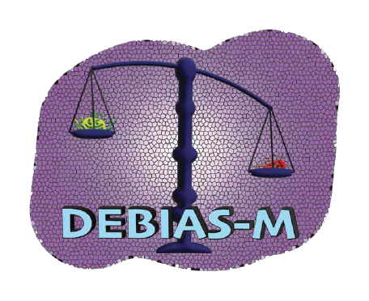

<!-- # “default”, “bootstrap”, “cerulean”, “cosmo”, “darkly”, “flatly”, “journal”, “lumen”, “paper”, “readable”, “sandstone”, “simplex”, “spacelab”, “united”, “yeti” -->

<!-- united -->

<style>
.darkgreen {
  background-color: #577836;
  color: white;
  border: 2px solid black;
  margin: 20px;
  padding: 20px;
} 
</style>

<style>
    body { 
            background-color: #16153C;
            text-color: whitesmoke;
            color: whitesmoke;
            font-family: Palatino;
            font-size: 12pt;
            margin: 10px;
            padding: 0px;
            }

</style>

<link rel="icon" type="image/png" href="images/DEBIAS-M-logo.png" />
</center>

<style>
.alert {
  background-color: red;
  border: 3px solid black;
  font-weight: bold;
  color: whitesmoke; 
}
</style>

```{css, echo=FALSE}
.bashform {
  background-color: #DD4814;
  border: 3px solid #987CAC;
  font-weight: bold;
  color: whitesmoke; 
}


```

--------------------------
```{r klippy, echo=FALSE, include=TRUE}
klippy::klippy(c('r', 'python', 'bash', 'bashform'), 
               position = c("top", "right"),
               color='#16153C',
               tooltip_message = "Copy",
               tooltip_success = "Copied!"
               )
```
<div class='body'>

Welcome to [__DEBIAS-M__](index.html)! This is a python package for processing bias correction in microbiome studies, that facilitates data harmonization, domain adaptation, predictive modeling, and batch correction.

<br>
DEBIAS-M is designed to work across multiple microbiome studies, and has a variety of versions depending on applications:

 * [__DebiasMClassifier__](DebiasMClassifier.html) - classification  
 * [__DebiasMRegressor__](DebiasMRegressor.html) - regression
 * [__MultitaskDebiasMClassifier__](MultitaskDebiasMClassifier.html) - multitask classification
 * [__MultitaskDebiasMRegressor__](MultitaskDebiasMRegressor.html) - multitask regression
 * [__OnlineDebiasMClassifier__](OnlineDebiasMClassifier.html) - online adaptation for classification
 * [__DebiasMClassifierLogAdd__](DebiasMClassifierLogAdd.html) - bias correction in logarithmic space

<br>
For any support using DEBIAS-M, please use our <a href="https://github.com/korem-lab/DEBIAS-M/issues">issues page</a> or email [gia2105@columbia.edu](gia2105@columbia.edu). 
<br> <br>


## Installation

```bashform
pip install DEBIAS-M
```

The dependencies for installation are `python`,  `scikit-learn`, `torch`, and `pytorch-lightning`
<br><br>

## Loading

```python
from debiasm import DebiasMClassifier, DebiasMRegressor, MultitaskDebiasMClassifier, MultitaskDebiasMRegressor, OnlineDebiasMClassifier, DebiasMClassifierLogAdd
```

<br>

## Background

It has been shown that each experimental processing and bioinformatic step in microbiome analysis pipelines has distinct biases that multiplicatively over- and understate the relative abundance of various microbes. As a result, one can find significant differences even when the same sample is processed in different protocols. This would typically manifest as strong study- and batch-effects. DEBIAS-M addresses this issue using a model of multiplicative taxon-specific biases combined with 2 key assumption: (1) the average microbiome composition of different batches/studies should be similar; (2) there is an underlying association between the microbiome and provided phenotype that is diminished by bias and will become stronger when bias is corrected. For more details, please refer to [our manuscript](https://www.biorxiv.org/content/10.1101/2024.02.09.579716v1), where we show that DEBIAS-M improves batch correction and predictive modeling across microbiome studies, and changes the underlying data using explainable and quasi-mechanistic parameters. 
<br><br>
The inputs, outputs, and syntax within the DEBIAS-M package are built using a scikit-learn base, and are designed to have similar functionality to standard scikit-learn classes, such as `dmc.fit(X, Y)`, `dmc.transform(X)`, and `dmc.predict_proba(X)`. For example: 

```python
## import packages
import numpy as np
from sklearn.metrics import roc_auc_score
from debiasm import DebiasMClassifier

## generate data for the example
np.random.seed(123)
n_samples = 96*5
n_batches = 5
n_features = 100

## the read count matrix
X = ( np.random.rand(n_samples, n_features) * 1000 ).astype(int)

## the labels
y = np.random.rand(n_samples)>0.5

## the batches
batches = ( np.random.rand(n_samples) * n_batches ).astype(int)

## we assume the batches are numbered ints starting at '0',
## and they are in the first column of the input X matrices
X_with_batch = np.hstack((batches[:, np.newaxis], X))
## set the valdiation batch to '4'
val_inds = batches==4
X_train, X_val = X_with_batch[~val_inds], X_with_batch[val_inds]
y_train, y_val = y[~val_inds], y[val_inds]

### Run DEBIAS-M, using standard sklearn object methods
dmc = DebiasMClassifier(x_val=X_val) ## give it the held-out inputs to account for
                                    ## those domains shifts while training
dmc.fit(X_train, y_train)

## Assess results
### should be ~~0.5 in this example , since the data is all random
roc_auc_score(y_val, dmc.predict_proba(X_val)[:, 1]) 

## extract the 'DEBIAS-ed' data for other downstream analyses, if applicable 
X_debiassed = dmc.transform(X_with_batch)
```

For more details, we provide further background and walkthrough demonstrations for each of DEBIAS-M's classes in their respective documentation tabs.

<br>


## Citation
<style>
.citation {
  background-color: #A1DDF2;
  color: black;
  border: 3px solid #987CAC;
  margin: 20px;
  padding: 20px;
} 
</style>

<div class="citation">
Austin, G.I. et al. "Processing-bias correction with DEBIAS-M improves cross-study generalization of microbiome-based prediction models" (2024). **https://doi.org/10.1101/2024.02.09.579716**
</div>

